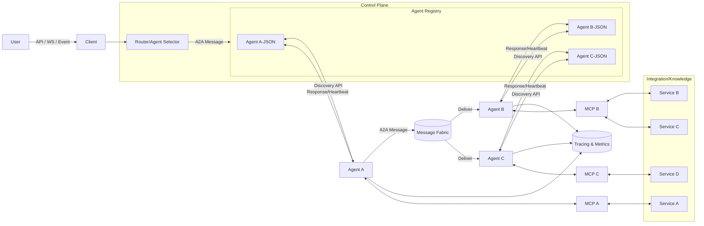

# HR Policy MCP Server

This server provide resources of policy and maintain policy records for AI Agents to consume.

It also exposes simple math tools, and composes both MCP servers behind a single
auth-protected MCP endpoint using the official `modelcontextprotocol/python-sdk`.

## App Design Flow



## Directory Structure

```text
src/
  main.py                 # Composite MCP server (HR + math) with auth
  hr_policy_mcp/
    __init__.py           # Exposes hr_policy_mcp and registers resources
    server.py             # HR FastMCP instance + PolicyService wiring
    services/
      policy_service.py   # Loads PDF policies from static/dev/policy_files
    resources/
      policies.py         # Registers one MCP resource per policy
  math_mcp/
    __init__.py           # Exposes math_mcp and registers tools
    server.py             # Math FastMCP instance
    tools/
      basic.py            # add / subtract tools
  middleware/
    __init__.py
    token_verifier.py     # OAuth2 token introspection (Keycloak)

static/
  dev/
    policy_files/         # PDF HR policy documents
```

## Authentication

The main MCP server is configured similar to the `simple-auth` example in the
python SDK. It uses:

- Keycloak realm discovery at:
  `http://192.168.10.7:5555/realms/openspace/.well-known/openid-configuration`
- Token introspection endpoint:
  `http://192.168.10.7:5555/realms/openspace/protocol/openid-connect/token/introspect`
- Required scope: `mcp:tools` (configurable via env).

Client credentials are provided via environment variables (see `.env.example`).

## Running with uv (locally)

```bash
uv run src/main.py
```

The composite MCP server will listen on `http://127.0.0.1:3000/mcp` using the
`streamable-http` transport.

## Docker

Build and run with Docker directly:

```bash
docker build -t hr-policy-mcp .
docker run --rm -p 3000:3000 --env-file .env hr-policy-mcp
```

Or use docker-compose:

```bash
docker compose up --build
```

The MCP endpoint will be available at:

```text
http://127.0.0.1:3000/mcp
```

## Logging

The server emits two kinds of logs:

- **Standard Python logging**
  - Configured in `src/main.py` via `setup_logging()`.
  - Outputs to stdout/stderr and to `logs/server.log`.
  - Used by components like `PolicyService` to report loading/parse errors.

- **MCP Context logging**
  - Tools and resources accept a `ctx: Context[ServerSession, None]` argument.
  - HR policy resources log reads and failures via `ctx.info(...)` / `ctx.error(...)`.
  - Math tools log operations via `ctx.debug(...)`.
  - These logs are sent back to compatible MCP clients as notifications.
