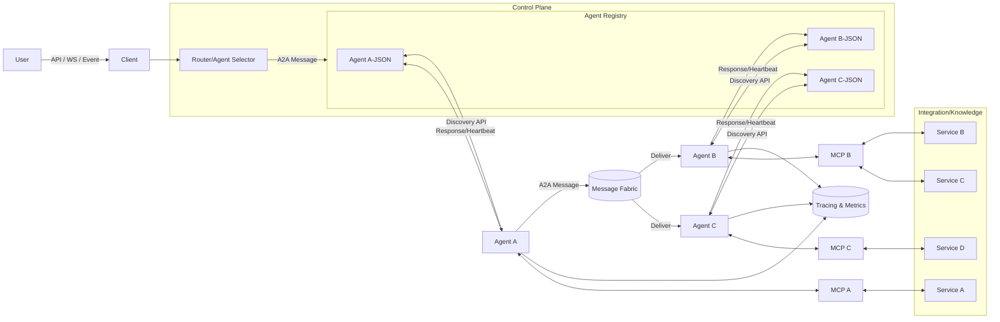

# HR Policy MCP Server

This server provide resources of policy and maintain policy records for AI Agents to consume

## App Design Flow

```mermaid
flowchart LR
subgraph ControlPlane[Control Plane]
subgraph Registry[Agent Registry]
AgentASG[Agent A-JSON]
AgentBSG[Agent B-JSON]
AgentCSG[Agent C-JSON]
end
LGRrouterN[Router/Agent Selector]
end

subgraph OrgServices[Integration/Knowledge]
ServiceA[Service A]
ServiceB[Service B]
ServiceC[Service C]
ServiceD[Service D]
end


Broker[(Message Fabric)]
Observability[(Tracing & Metrics)]


AgentA[Agent A]
AgentB[Agent B]
AgentC[Agent C]

McpA[MCP A]
McpB[MCP B]
McpC[MCP C]

User[User]

User -->|API / WS / Event| Client  
Client --> LGRrouterN
LGRrouterN -->|A2A Message| Registry
AgentA -->|A2A Message| Broker
Broker -->|Deliver| AgentB
Broker -->|Deliver| AgentC


AgentA -->|Response/Heartbeat| AgentASG
AgentB -->|Response/Heartbeat| AgentBSG
AgentC -->|Response/Heartbeat| AgentCSG


AgentASG <-->|Discovery API| AgentA
AgentBSG <-->|Discovery API| AgentB
AgentCSG <-->|Discovery API| AgentC


AgentA --> Observability
AgentB --> Observability
AgentC --> Observability

AgentA <--> McpA
AgentB <--> McpB
AgentC <--> McpC

McpA <--> ServiceA
McpB <--> ServiceB
McpC <--> ServiceD
McpB <--> ServiceC
```
